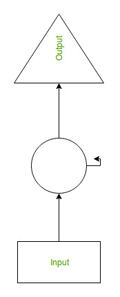

# Introduction, RNN and Sentiment Analysis


## Tokenization

*Tokenization is the process of breaking text down into individual words. Word windows are also composed of tokens.*\
Tokenization is a common task in Natural Language Processing (NLP). It’s a fundamental step in both traditional NLP methods like Count Vectorizer and Advanced Deep Learning-based architectures like Transformers*\
**"Tokens are the building blocks of Natural Language."**\
*Tokenization is a way of separating a piece of text into smaller units called tokens. Here, tokens can be either words, characters, or subwords. Hence, tokenization can be broadly classified into 3 types – word, character, and subword (n-gram characters) tokenization*\
For example, consider the sentence: “Never give up”.\
The most common way of forming tokens is based on space. Assuming space as a delimiter, the tokenization of the sentence results in 3 tokens – Never-give-up. As each token is a word, it becomes an example of Word tokenization*

## Reasons behind Tokenization


*Tokenization is performed on the corpus to obtain tokens. The following tokens are then used to prepare a vocabulary. Vocabulary refers to the set of unique tokens in the corpus. Remember that vocabulary can be constructed by considering each unique token in the corpus*\
**"Creating Vocabulary is the ultimate goal of Tokenization"**\
* *Traditional NLP approaches such as Count Vectorizer and TF-IDF use vocabulary as features. Each word in the vocabulary is treated as a unique feature*\
* *In Advanced Deep Learning-based NLP architectures, vocabulary is used to create the tokenized input sentences. Finally, the tokens of these sentences are passed as inputs to the model*

## Which Tokenization Should you use

*Word Tokenization:*
* *Word Tokenization is the most commonly used tokenization algorithm. It splits a piece of text into individual words based on a certain delimiter. Depending upon delimiters, different word-level tokens are formed. Pretrained Word Embeddings such as Word2Vec and GloVe comes under word tokenization.*

*Character Tokenization:*
* *Character Tokenization splits apiece of text into a set of characters. It overcomes the drawbacks we saw above about Word Tokenization.*
* *Character Tokenizers handles OOV words coherently by preserving the information of the word. It breaks down the OOV word into characters and represents the word in terms of these characters*
* *It also limits the size of the vocabulary. Want to talk a guess on the size of the vocabulary? 26 since the vocabulary contains a unique set of characters*

*Subword Tokenization:*
* *Subword Tokenization splits the piece of text into subwords (or n-gram characters). For example, words like lower can be segmented as low-er, smartest as smart-est, and so on.*

## Embedding


**Word embeddings provide a dense representation of words and their relative meanings**

*They are an improvement over sparse representations used in simpler bag of word model representations.\
Word embeddings can be learned from text data and reused among projects. They can also be learned as part of fitting a neural network on text data.*

## Word Embedding Algorithms
Two popular examples of methods of learning word embeddings from text include:
  * *Word2Vec.*
  *GloVe.

**Word2Vec**\
*Word2Vec is a statistical method for efficiently learning a standalone word embedding from a text corpus.\
It was developed by Tomas Mikolov, et al. at Google in 2013 as a response to make the neural-network-based training of the embedding more efficient and since then has become the de facto standard for developing pre-trained word embedding\
Two different learning models were introduced that can be used as part of the word2vec approach to learn the word embedding; they are:\
Continuous Bag-of-Words, or CBOW model.\
Continuous Skip-Gram Model.\
The CBOW model learns the embedding by predicting the current word based on its context. The continuous skip-gram model learns by predicting the surrounding words given a current word.\
The continuous skip-gram model learns by predicting the surrounding words given a current word.*


**GloVe**\
*The Global Vectors for Word Representation, or GloVe, algorithm is an extension to the word2vec method for efficiently learning word vectors, developed by Pennington, et al. at Stanford.\
Classical vector space model representations of words were developed using matrix factorization techniques such as Latent Semantic Analysis (LSA) that do a good job of using global text statistics but are not as good as the learned methods like word2vec at capturing meaning and demonstrating it on tasks like calculating analogies (e.g. the King and Queen example above).\
GloVe is an approach to marry both the global statistics of matrix factorization techniques like LSA with the local context-based learning in word2vec.\
Rather than using a window to define local context, GloVe constructs an explicit word-context or word co-occurrence matrix using statistics across the whole text corpus. The result is a learning model that may result in generally better word embeddings*

## Padding

*Padding is a special form of masking where the masked steps are at the start or the end of a sequence. Padding comes from the need to encode sequence data into contiguous batches: in order to make all sequences in a batch fit a given standard length, it is necessary to pad or truncate some sequences.i.e.* **add the zeros at the end of the sequence to make the samples in the same size**

raw_inputs = [\
    [711, 632, 71],\
    [73, 8, 3215, 55, 927],\
    [83, 91, 1, 645, 1253, 927],\
]


The result of the padding sequences is pretty straight forward. You can now observe that the list of sentences that have been padded out into a matrix where each row in the matrix has an encoded sentence with the same length this is due to the
* additional zeros for short sentences and
* *truncating the sentences which exceed the max number of words which is declared by maxlen.*

*[[ 711  632   71    0    0    0]\
 [  73    8 3215   55  927    0]\
 [  83   91    1  645 1253  927]]*

## RNN Logic

*example:*

*Suppose there is a deeper network with one input layer, three hidden layers and one output layer. Then like other neural networks, each hidden layer will have its own set of weights and biases, let’s say, for hidden layer 1 the weights and biases are (w1, b1), (w2, b2) for second hidden layer and (w3, b3) for third hidden layer. This means that each of these layers are independent of each other, i.e. they do not memorize the previous outputs.*


* RNN converts the independent activations into dependent activations by providing the same weights and biases to all the layers, thus reducing the complexity of increasing parameters and memorizing each previous outputs by giving each output as input to the next hidden layer.
* *Hence these three layers can be joined together such that the weights and bias of all the hidden layers is the same, into a single recurrent layer.*



* Formula for calculating current state:


*ht -> current state\
ht-1 -> previous state\
xt -> input state*

* Formula for applying Activation function(tanh):


*whh -> weight at recurrent neuron\
wxh -> weight at input neuron*

* Formula for calculating output:


*Yt -> output\
Why -> weight at output layer*

## RNN code

### Coding RNN using Python


## Sentiment analysis explanation and code

*Sentiment analysis (or opinion mining) is a natural language processing technique used to determine whether data is positive, negative or neutral. Sentiment analysis is often performed on textual data to help businesses monitor brand and product sentiment in customer feedback, and understand customer needs.*

*There are different algorithms you can implement in sentiment analysis models, depending on how much data you need to analyze, and how accurate you need your model to be. We’ll go over some of these in more detail, below.*

Sentiment analysis algorithms fall into one of three buckets:

* Rule-based: these systems automatically perform sentiment analysis based on a set of manually crafted rules.
* Automatic: systems rely on machine learning techniques to learn from data.
* Hybrid systems combine both rule-based and automatic approaches.*

*Rule-based Approaches
Usually, a rule-based system uses a set of human-crafted rules to help identify subjectivity, polarity, or the subject of an opinion.\
These rules may include various NLP techniques developed in computational linguistics, such as:\
* Stemming, tokenization, part-of-speech tagging and parsing.
* Lexicons (i.e. lists of words and expressions).
Here’s a basic example of how a rule-based system works:\
* Defines two lists of polarized words (e.g. negative words such as bad, worst, ugly, etc and positive words such as good, best, beautiful, etc).
* Counts the number of positive and negative words that appear in a given text.
* If the number of positive word appearances is greater than the number of negative word appearances, the system returns a positive sentiment, and vice versa. If the numbers are even, the system will return a neutral sentiment.

Rule-based systems are very naive since they don't take into account how words are combined in a sequence. Of course, more advanced processing techniques can be used, and new rules added to support new expressions and vocabulary. However, adding new rules may affect previous results, and the whole system can get very complex. Since rule-based systems often require fine-tuning and maintenance, they’ll also need regular investments*

**Automatic Approaches**\
Automatic methods, contrary to rule-based systems, don't rely on manually crafted rules, but on machine learning techniques. A sentiment analysis task is usually modeled as a classification problem, whereby a classifier is fed a text and returns a category, e.g. positive, negative, or neutral*

**Hybrid Approaches**\
Hybrid systems combine the desirable elements of rule-based and automatic techniques into one system. One huge benefit of these systems is that results are often more accurate.*

import re

import tweepy

from tweepy import OAuthHandler 

from textblob import TextBlob

class TwitterClient(object):

	''' 
    
   
	Generic Twitter Class for sentiment analysis.
    
	'''
    
	def __init__(self):
    
		''' 
		Class constructor or initialization method.
		'''
		# keys and tokens from the Twitter Dev Console 
		consumer_key = 'XXXXXXXXXXXXXXXXXXXXXXXX'
		consumer_secret = 'XXXXXXXXXXXXXXXXXXXXXXXXXXXX'
		access_token = 'XXXXXXXXXXXXXXXXXXXXXXXXXXXX'
		access_token_secret = 'XXXXXXXXXXXXXXXXXXXXXXXXX'

		# attempt authentication 
		try: 
			# create OAuthHandler object 
			self.auth = OAuthHandler(consumer_key, consumer_secret) 
			# set access token and secret 
			self.auth.set_access_token(access_token, access_token_secret) 
			# create tweepy API object to fetch tweets 
			self.api = tweepy.API(self.auth) 
		except: 
			print("Error: Authentication Failed") 

	def clean_tweet(self, tweet): 
		''' 
		Utility function to clean tweet text by removing links, special characters 
		using simple regex statements. 
		'''
		return ' '.join(re.sub("(@[A-Za-z0-9]+)|([^0-9A-Za-z \t]) 
									|(\w+:\/\/\S+)", " ", tweet).split()) 

	def get_tweet_sentiment(self, tweet): 
		''' 
		Utility function to classify sentiment of passed tweet 
		using textblob's sentiment method 
		'''
		# create TextBlob object of passed tweet text 
		analysis = TextBlob(self.clean_tweet(tweet)) 
		# set sentiment 
		if analysis.sentiment.polarity > 0: 
			return 'positive'
		elif analysis.sentiment.polarity == 0: 
			return 'neutral'
		else: 
			return 'negative'

	def get_tweets(self, query, count = 10): 
		''' 
		Main function to fetch tweets and parse them. 
		'''
		# empty list to store parsed tweets 
		tweets = [] 

		try: 
			# call twitter api to fetch tweets 
			fetched_tweets = self.api.search(q = query, count = count) 

			# parsing tweets one by one 
			for tweet in fetched_tweets: 
				# empty dictionary to store required params of a tweet 
				parsed_tweet = {} 

				# saving text of tweet 
				parsed_tweet['text'] = tweet.text 
				# saving sentiment of tweet 
				parsed_tweet['sentiment'] = self.get_tweet_sentiment(tweet.text) 

				# appending parsed tweet to tweets list 
				if tweet.retweet_count > 0: 
					# if tweet has retweets, ensure that it is appended only once 
					if parsed_tweet not in tweets: 
						tweets.append(parsed_tweet) 
				else: 
					tweets.append(parsed_tweet) 

			# return parsed tweets 
			return tweets 

		except tweepy.TweepError as e: 
			# print error (if any) 
			print("Error : " + str(e)) 

def main(): 

	# creating object of TwitterClient Class
    
	api = TwitterClient() 
    
	# calling function to get tweets 
    
	tweets = api.get_tweets(query = 'Donald Trump', count = 200) 

	# picking positive tweets from tweets 
	ptweets = [tweet for tweet in tweets if tweet['sentiment'] == 'positive'] 
	# percentage of positive tweets 
	print("Positive tweets percentage: {} %".format(100*len(ptweets)/len(tweets))) 
	# picking negative tweets from tweets 
	ntweets = [tweet for tweet in tweets if tweet['sentiment'] == 'negative'] 
	# percentage of negative tweets 
	print("Negative tweets percentage: {} %".format(100*len(ntweets)/len(tweets))) 
	# percentage of neutral tweets 
	print("Neutral tweets percentage: {} % \ 
		".format(100*(len(tweets) -(len( ntweets )+len( ptweets)))/len(tweets))) 

	# printing first 5 positive tweets 
	print("\n\nPositive tweets:") 
	for tweet in ptweets[:10]: 
		print(tweet['text']) 

	# printing first 5 negative tweets 
	print("\n\nNegative tweets:") 
	for tweet in ntweets[:10]: 
		print(tweet['text']) 

if __name__ == "__main__": \
	# calling main function\
	main()


## Introduction to Bert

## Intro and basics

### What is BERT?

*BERT stands for Bidirectional Encoder Representations from Transformers. It is designed to pre-train deep bidirectional representations from unlabeled text by jointly conditioning on both left and right context. As a result, the pre-trained BERT model can be fine-tuned with just one additional output layer to create state-of-the-art models for a wide range of NLP tasks*

*BERT relies on a Transformer (the attention mechanism that learns contextual relationships between words in a text). A basic Transformer consists of an encoder to read the text input and a decoder to produce a prediction for the task. Since BERT’s goal is to generate a language representation model, it only needs the encoder part. The input to the encoder for BERT is a sequence of tokens, which are first converted into vectors and then processed in the neural network. But before processing can start, BERT needs the input to be massaged and decorated with some extra metadata:*

* Token embeddings: A [CLS] token is added to the input word tokens at the beginning of the first sentence and a [SEP] token is inserted at the end of each sentence.
* Segment embeddings: A marker indicating Sentence A or Sentence B is added to each token. This allows the encoder to distinguish between sentences.
* Positional embeddings: A positional embedding is added to each token to indicate its position in the sentence


```python

```
