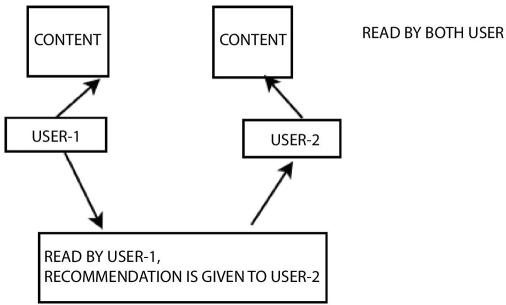

# Recommender Systems

A recommender system is a sub-category of an information extraction system that helps to find the ranking or user preference for a particular item. Recommendation systems are dedicated software and methods that give ideas related to things that are used by different users [1, 2]. Many decisions can be made by considering recommendations like which product to purchase, type of music to listen, or what and where to read online news.

The things that are suggested by the system are known as “Item”. A recommender system generally concentrates on a particular form of item like DVDs, or articles and thus its proposal, its graphical user interface (GUI), and the primary method used to make the suggestions are adapted to give beneficial and real recommendations for a particular form of item.

# What is the use of Recommender systems?

1. A recommender system seeks to estimate and predict user content preference regarding games, stories or videos. The system draws from data usage history, aiming at making suggestions based on the user’s (current) interests.  

2. A recommender system usually employs data sources to learn more about such preferences, making good use of explicit feedback resulting from diverse evaluation metrics such as “Add To Favorites” for example, or implicit feedback deriving from the number and length of content-based interactions.   

3. Within the implicit feedback approach, a basic algorithm despite being more elaborate than the one which generates completely random recommendations, consists of reflecting most popular content, summing up all user activity and recommending most common content in relation to the number and length of visits.

4. A third algorithm is about quantifying user preference similarity based on the visited content which the users jointly have, identifying groups by “preference profile”. Once these groups have been identified, the system will recommend to the user content which has not yet been visited, but seems appealing to the other members of the group. This algorithm is known as collaborative filtering.

5. Lastly, it is possible to employ a hybrid algorithm, that is to say, an algorithm which combines content predictions based on popularity and novelty metrics, and collaborative filtering. This is the method we implement at Smile and Learn, generating recommendation content lists, with regard to each one of the algorithms, so as to rearrange and fuse data, building upon new content prediction results.

6. It so happens, that the more feedback data-driven decision models can collect, the more robust the prediction will be; that’s why it’s crucial for the content to be highly appealing. As we access new data, we make room for a promising chapter in which we’re able to detect new patterns, develop more explanatory hypotheses and progressively design more informative and consequently relevant, usage and learning metrics.

7. Overcome the limitations of collaborative filtering, content-based and other systems.

8. Recommendation results have been improved.

9. Can work on sparse data also.

# COLLABORATIVE FILTER

The recommender system uses this technique more frequently to establish social filtering by collecting user experiences. It can analyze the similarity pattern among users or items in a very sensible way.

The first approach under collaborative filtering is item to item approach where we concentrate on the neighborhood analysis, as shown in Figure 2.2. Consider that the user-1 has the same opinion about a product as of user-2 then the behavior content of the emotion of both the users is suitable for establishing the collaborative filtering.

Another approach is the classification filtering. It is a learning method that is used to determine which class the product will lie after classifying its behavior attributes more collaboratively. In a broad sense, collaborative filtering is divided into memory-based (calculating neighborhood) and model-based (Using different data mining techniques: Bayesian network, clustering, semantic analysis).

# HYBRID MODEL

A huge number of online users have trust in recommender systems. It delivers an explanation about an item that why is it recommended for a specific set of users. This technique has gathered attention in helping users with quality decision making. The working mechanism relies upon the accuracy of the model. So, before implementing, the author must recommend to study the theoretical aspect of the proposed model and must instantiate its effectiveness in a real-world environment. Nowadays, the recommender system hugely impacts people’s lives. So, the growing need of users upon the recommendation system must ensure its ability to explain, its consistency and diversity. Hybrid filtering leverages the beauty of both content and collaborative data. This method has the potential to tackle both content and collaborative data in its term and combine the efforts of both to produce a system from their strategic advantage. It uses accuracy metric techniques for more user centrist evaluation for delivering recommendations. The proposed model described in Figure 2.5, concentrates on collecting user argument, like or dislike attribute list, demographic data, range of financial reimbursement, product/person choice, category, etc. Adhering to those attribute lists, we must build a suggestion-explanation metric window for the user. It must ensure lucid presentation quality in explanation. It tied closely to domain-specific attributes and characteristics of specific data available. A hybrid filtering based explanation in the recommender system calculates the product affinity with a similar set of users that can further emerge as a better-matched pair. 

# Cosine similarity: 

It is used to measure similarity between user and item. This way gives user–item similarity. This method is best when we have high dimensional features especially in information retrieval and text mining. The range of this is between −1 and 1.There are two approaches:

### 1. Top-n approach :  
    
According to this, top n best products are recommended and value of ‘n’ is decided by user

### 2. Rating scale approach:

A prefixed threshold is fixed and all the items having value greater than threshold are suggested as given in below Equation .

# Euclidean Distance: 
It is computed using the formula given in below Equation
 

# Types of Recommender systems

Different types of recommendation system are available that differ in terms of problem domain, Information used, and importantly recommendation algorithm used to make prediction. There are mainly two types of recommendation systems as shown in Figure below i.e. content-based RS and Collaborative filtering methods.

## 1. CONTENT-BASED

Based on the previous responses submitted by the user, the system learns to make recommendations by analyzing the feature similarity among items. For example, based upon the rating of a user for different genre of movies, the system will learn to recommend the genre which is positively rated by the user. A content-based recommendation system builds a user profile based upon the previously rated items by the user. A user profile represents the user interests and is able to adapt to new interest also. Matching of user profile against the features of content object is basically the recommendation process. Result of this process is a judgment that signifies the user interest in the object. A highly accurate profile of user interests will result in usefulness of an information access process. For instance, it might be used to filter the web results by determining whether a user is interested in the specific page or not.

Content Recommendation systems acquire the recommendation idea from the past data of a user based on what items a user has purchased or liked. Both user and item attributes are of equal importance in terms of making a prediction. Consider the example of news recommender, features like categories (Finance, Sports, Health, Technology, Politics, Entertainment, Automobile, etc.) or location (local, national or international) etc. are required to find the similarity index between news. To extract features like sentiment score, TF-IDF scores are used. In this approach, the profile of each user as well as each item is created and two vectors are created.

Item vector: A vector of length N and contains value 1 for words having high TF-IDF and 0 otherwise.

User vector: A 1 × N vector containing probability of occurrence of word of every word in the article. The user vector is based in the attributes of item.

In content based methods, the recommendation problem is casted into either a classification problem (predict if a user “likes” or not an item) or into a regression problem (predict the rating given by a user to an item). In both cases, we are going to set a model that will be based on the user and/or item features at our disposal (the “content” of our “content-based” method).
If our classification (or regression) is based on users features, we say the approach is item-centred: modelling, optimisations and computations can be done “by item”. In this case, we build and learn one model by item based on users features trying to answer the question “what is the probability for each user to like this item?” (or “what is the rate given by each user to this item?”, for regression). The model associated to each item is naturally trained on data related to this item and it leads, in general, to pretty robust models as a lot of users have interacted with the item. However, the interactions considered to learn the model come from every users and even if these users have similar characteristic (features) their preferences can be different. This mean that even if this method is more robust, it can be considered as being less personalised (more biased) than the user-centred method thereafter.

If we are working with items features, the method is then user-centred: modelling, optimisations and computations can be done “by user”. We then train one model by user based on items features that tries to answer the question “what is the probability for this user to like each item?” (or “what is the rate given by this user to each item?”, for regression). We can then attach a model to each user that is trained on its data: the model obtained is, so, more personalised than its item-centred counterpart as it only takes into account interactions from the considered user. However, most of the time a user has interacted with relatively few items and, so, the model we obtain is a far less robust than an item-centred one.

From a practical point of view, we should underline that, most of the time, it is much more difficult to ask some information to a new user (users do not want to answer too much questions) than to ask lot of information about a new item (people adding them have an interest in filling these information in order to make their items recommended to the right users). We can also notice that, depending on the complexity of the relation to express, the model we build can be more or less complex, ranging from basic models (logistic/linear regression for classification/regression) to deep neural networks. Finally, let’s mention that content based methods can also be neither user nor item centred: both informations about user and item can be used for our models, for example by stacking the two features vectors and making them go through a neural network architecture.

### Item-centred Bayesian classifier

Let’s first consider the case of an item-centred classification: for each item we want to train a Bayesian classifier that takes user features as inputs and output either “like” or “dislike”. So, to achieve the classification task, we want to compute

are likelihoods assumed to follow Gaussian distributions with parameters to be determined also from data. Various hypothesis can be done about the covariance matrices of these two likelihood distributions (no assumption, equality of matrices, equality of matrices and features independence) leading to various well known models (quadratic discriminant analysis, linear discriminant analysis, naive Bayes classifier). We can underline once more that, here, likelihood parameters have to be estimated only based on data (interactions) related to the considered item.

### User-centred linear regression

Let’s now consider the case of a user-centred regression: for each user we want to train a simple linear regression that takes item features as inputs and output the rating for this item. We still denote M the user-item interaction matrix, we stack into a matrix X row vectors representing users coefficients to be learned and we stack into a matrix Y row vectors representing items features that are given. Then, for a given user i, we learn the coefficients in X_i by solving the following optimisation problem

where one should keep in mind that i is fixed and, so, the first summation is only over (user, item) pairs that concern user i. We can observe that if we solve this problem for all the users at the same time, the optimisation problem is exactly the same as the one we solve in “alternated matrix factorisation” when we keep items fixed. This observation underlines the link we mentioned in the first section: model based collaborative filtering approaches (such as matrix factorisation) and content based methods both assume a latent model for user-item interactions but model based collaborative approaches have to learn latent representations for both users and items whereas content-based methods build a model upon human defined features for users and/or items.

## 2. COLLABORATIVE FILTERING

This approach uses ‘user behavior’ for recommendations. In this approach, there is no feature corresponding to users or items. It uses a utility matrix and most commonly used in industries as it is independent from any additional information.

Limitation of content-based recommendation system can be overcome by the collaborative approach for instance it can make prediction for those items for which content is not available. It uses the feedback of other users to recommend such items. These systems evaluate the quality of an item based on peer review. It can also suggest products with different content as long as other users have shown the interest in the content.

There are 2 categories of collaborative filtering as shown in Figure 

### 1. Memory-based (neighborhood) approach: 
In this, utility matrix is learnt and suggestions are given by asking the given user with rest of the utility matrix. Let’s suppose we have ‘m’ movies and ‘u’ users. To find out how much user likes movie ‘k’ Equation 5 is used:

The above formula will give the average ranking that customer ‘i’ has specified to all the items. Rating of product can be estimated as given in Equation:

It is easy to compute, but if data becomes sparse, performance becomes poor. Now the similarity between users ‘a’ and ‘i’ can be calculated using the methods like cosine similarity, Pearson’s correlation, etc.

Memory-Based Collaborative Filtering is further divided into two categories i.e. user-based filtering and item-based filtering

##### User-Item filtering: 
 
In this method, for a new item ‘i’ for a particular user ‘u’ rankings of nearest neighbors of user ‘u’ are used to compute the ranking rui of the user ‘u’ but only those neighbors are considered who have already given a ranking for the item ‘i’. The rating rui can be estimated as shown in Equation 

Above equation does not consider the different level of similarity can occur among neighbors.

The prediction of item is calculated by computing the weighted sum of the user ratings of ‘user-neighbors’ given by other users to item ‘i’. The prediction is given by the formula in Equation 

Where Pu,i is the prediction of an item, Rv,i is the rating given by a user ‘v’ to an item image and Su,v is the similarity between users

What will happen if a new user or new item is inserted in the dataset? There is term known as cold start which is of two types:

Visitor cold start: 

When a new consumer is presented to the knowledgebase, as system is not having any past data of the user, it becomes difficult to suggest any product to him. To resolve this issue, overall or regionally most popular products are recommended.

Product cold start: 

When a new item comes in the market or given to the system, user’ actions are required to decide its value. Higher the reviews and ratings product got from users, the easier it becomes for the system to suggest to appropriate consumer.

### 2. Model based approach: 

This model represents users and items using utility matrix i.e. utility matrix is decomposed into A and B matrix where A signifies user and B denotes the items. For matrix decomposition, different techniques like SVD, PCA are used. Rating of each item is computed and product with highest rating is recommended. This model is beneficial when available data is large in volume.As per my understanding, the algorithms in this approach can further be broken down into 3 sub-types.
 
 
 
 
###  Matrix Factorization (MF): 

The idea behind such models is that attitudes or preferences of a user can be determined by a small number of hidden factors. We can call these factors as Embeddings.Matrix decomposition can be reformulated as an optimization problem with loss functions and constraints. Now the constraints are chosen based on property of our model. For e.g. for Non negative matrix decomposition, we want non negative elements in resultant matrices.
 

Embeddings:

Intuitively, we can understand embeddings as low dimensional hidden factors for items and users. For e.g. say we have 5 dimensional (i.e. D or n_factors = 5 in above figure) embeddings for both items and users (# 5 chosen randomly). Then for user-X & movie-A, we can say the those 5 numbers might represent 5 different characteristics about the movie, like (i) how much movie-A is sci-fi intense (ii) how recent is the movie (iii) how much special effects are in movie A (iv) how dialogue driven is the movie (v) how CGI driven is the movie. Likewise, 5 numbers in user embedding matrix might represent, (i) how much does user-X like sci-fi movie (ii) how much does user-X like recent movies …and so on. In above figure, a higher number from dot product of user-X and movie-A matrix means that movie-A is a good recommendation for user-X.

Matrix factorization can be done by various methods and there are several research papers out there. In next section, there is python implementation for orthogonal factorization (SVD) or probabilistic factorization (PMF) or Non-negative factorization (NMF).
Non parametric approach (KNN): The idea is same as that of memory-based recommendation systems. In memory-based algorithms, we use the similarities between users and/or items and use them as weights to predict a rating for a user and an item. The difference is that the similarities in this approach are calculated based on an unsupervised learning model, rather than Pearson correlation or cosine similarity. In this approach, we also limit the number of similar users as k, which makes system more scalable.
Neural Nets/ Deep Learning: There is a ton of research material on collaborative filtering using matrix factorization or similarity matrix. But there is lack on online material to learn how to use deep learning models for collaborative filtering. This is something that I learnt in fast.ai deep learning part 1 v2.
Below is the visualization to explain what is happening when we are using neural nets for this problem.

We can think of this as an extension to matrix factorization method. For SVD or PCA, we decompose our original sparse matrix into product of 2 low rank orthogonal matrices. For neural net implementation, we don’t need them to be orthogonal, we want our model to learn the values of embedding matrix itself. The user latent features and movie latent features are looked up from the embedding matrices for specific movie-user combination. These are the input values for further linear and non-linear layers. We can pass this input to multiple relu, linear or sigmoid layers and learn the corresponding weights by any optimization algorithm (Adam, SGD, etc.).

# 3.HYBRID SYSTEM

In this, two or more techmiques are combined like content-based and collaborative fltering. Limitations of one techniques can be overcommed by other technique. There are several classes of Hybrid Recommendation Systems:

1. Mixed — In this, number of different techniques are combined together to design a system. Here the generated item lists of each technique are added to produce a final list of recommended items. Recommendations made by all techniques are combined and final result is presented to user.
2. Weighted — In these, weighted linear functions are used to compute the rank of products by aggregating the output ranks of all systems. P- Tango is the first weighted hybrid system for online newspaper recommender system.
3. Cascade — These systems work in stages. First method is used to make a rough rating of products and then generated list is refined by second method. In these systems, order of processes matters a lot.
4. Feature augmentation — In feature augmentation systems, output of one system acts as input to other system. These are also order-sensitive.
5. Switching — In this, system switches among various recommending methods depending on some conditions. For instance, a CF-CBF method may shift to the content-based recommender if collaborative filtering method doesn’t offer sufficient reliable results.

A robust system that combines various models to combat the disadvantage of one model with the advantage of another. In this chapter, we will build a simple hybrid recommender that combines the content and the collaborative filters that we've built thus far.

As already mentioned a couple of times, hybrid recommenders are extremely powerful, robust systems that combine various simpler models to give us predictions. There is no single way in which a hybrid model could do this; some hybrids predict using content and collaborative filtering techniques separately to produce results. Some others introduce content-based techniques into collaborative filters and vice versa. 

Netflix is a very good example of a hybrid recommender. Netflix employs content-based techniques when it shows you similar movies to a movie you're watching (the MORE LIKE THIS section), as shown in the following screenshot:

Here, we can see that while watching Ratatouille, Netflix recommends movies to me that are very similar to Ratatouille. All the top five recommended movies are all animated and produced by Disney Pixar.

However, animated movies are not the only genre I watch on Netflix. I also like watching drama and comedy. Netflix has a separate row of recommendations for me entitled Top Picks for Rounak, where it uses collaborative filtering to identify users similar to me and recommend movies that they have liked, but that I haven't watched:

In this way, Netflix employs both content- and collaborative-based techniques separately to produce results that are extremely satisfactory.

#### Case study – Building a hybrid model

In this section, let's build a content-based model that incorporates some collaborative filtering techniques into it.

Imagine that you have built a website like Netflix. Every time a user watches a movie, you want to display a list of recommendations in the side pane (like YouTube). At first glance, a content-based recommender seems appropriate for this task. This is because, if the person is currently watching something they find interesting, they will be more inclined to watch something similar to it. 

Let's say our user is watching The Dark Knight. Since this is a Batman movie, our content-based recommender is likely to recommend other Batman (or superhero) movies regardless of quality. This may not always lead to the best recommendations. For instance, most people who like The Dark Knight do not rate Batman and Robin very highly, although they feature the same lead character. Therefore, we will introduce a collaborative filter here that predicts the ratings of the movies recommended by our content-based model and return the top few movies with the highest predictions.

In other words, the workflow of our hybrid model will be as follows:

Take in a movie title and user as input
Use a content-based model to compute the 25 most similar movies
Compute the predicted ratings that the user might give these 25 movies using a collaborative filter
Return the top 10 movies with the highest predicted rating
We will be using different datasets for this task. Go ahead and download the datasets from the following links.

Download the following datasets from Kaggle and Google Drive:

ratings_small.csv: https://www.kaggle.com/rounakbanik/the-movies-dataset/downloads/ratings_small.csv/7.
movie_ids.csv: https://drive.google.com/drive/folders/1H9pnfVTzP46s7VwOTcC5ZY_VahRTr5Zv?usp=sharing.

The ratings_small.csv file contains 100,000 ratings for 9,000 movies from 700 users. We use this file since it contains ratings for more recent movies (the dataset we used for collaborative filtering only contained movies released before 1998).

The links_small.csv file contains the movie IDs of all the movies rated in the ratings_small.csv file and their corresponding titles. We can use these IDs to extract relevant metadata from the movies_metadata.csv file.

With these files in hand, let's proceed to build our model. The first step is to compute the cosine_sim matrix for our movies. In addition, we also need to map every movie to the indices in the cosine_sim matrix. We've already learned how to do this in Chapter 3, Building an IMDB Top 250 Clone with Pandas. Computing this matrix and the mapping, therefore, is left as an exercise for the reader. 

You can download my cosine_sim and cosine_sim_map files from the following link:
https://drive.google.com/drive/folders/1H9pnfVTzP46s7VwOTcC5ZY_VahRTr5Zv?usp=sharing. However, be aware that the cosine_sim file is over 1 GB in size, and therefore might take some time to download.
Next, let's use the ratings.csv file to build a collaborative filtering model. We will use the SVD model from the last chapter for this purpose:

#Build the SVD based Collaborative filter
from surprise import SVD, Reader, Dataset
- reader = Reader()
- ratings = pd.read_csv('../data/ratings_small.csv')
- data = Dataset.load_from_df(ratings[['userId', 'movieId', 'rating']], reader)
- data.split(n_folds=5)
- svd = SVD()
- trainset = data.build_full_trainset()
- svd.train(trainset)

Next, let's load the movie_ids.csv file into a DataFrame and construct two mappings: one that returns the movie title for a given movie ID, and the other vice versa:

#Build title to ID and ID to title mappings
- id_map = pd.read_csv('../data/movie_ids.csv')
- id_to_title = id_map.set_index('id')
- title_to_id = id_map.set_index('title')

Now, let's import the metadata for our movies so that our recommender can display useful information, such as the IMDB rating and the year of release. This information can be extracted from the main movies_metadata.csv file, and is again left as an exercise for the reader. 

You can download the required metadata file from the following link: https://drive.google.com/drive/folders/1H9pnfVTzP46s7VwOTcC5ZY_VahRTr5Zv?usp=sharing
We're finally in a position to build the hybrid recommender function according to the workflow described previously:

  - def hybrid(userId, title):
    #Extract the cosine_sim index of the movie
   - idx = cosine_sim_map[title]
    
    #Extract the TMDB ID of the movie
   - tmdbId = title_to_id.loc[title]['id']
    
    #Extract the movie ID internally assigned by the dataset
   - movie_id = title_to_id.loc[title]['movieId']
    
    #Extract the similarity scores and their corresponding index for every movie from the cosine_sim matrix
    -sim_scores = list(enumerate(cosine_sim[str(int(idx))]))
    
    #Sort the (index, score) tuples in decreasing order of similarity scores
   - sim_scores = sorted(sim_scores, key=lambda x: x[1], reverse=True)
    
    #Select the top 25 tuples, excluding the first 
    #(as it is the similarity score of the movie with itself)
    -sim_scores = sim_scores[1:26]
    
    #Store the cosine_sim indices of the top 25 movies in a list
    -movie_indices = [i[0] for i in sim_scores]

    #Extract the metadata of the aforementioned movies
   - movies = smd.iloc[movie_indices][['title', 'vote_count', 'vote_average', 'year', 'id']]
    
    #Compute the predicted ratings using the SVD filter
    -movies['est'] = movies['id'].apply(lambda x: svd.predict(userId, id_to_title.loc[x]['movieId']).est)
    
    #Sort the movies in decreasing order of predicted rating
   - movies = movies.sort_values('est', ascending=False)
    
    #Return the top 10 movies as recommendations
    -return movies.head(10)
    
Let's put our hybrid model to the test. Let's imagine that users with the IDs 1 and 2 are both watching the movie Avatar:

- hybrid(1, 'Avatar')

- hybrid(2, 'Avatar')

We can see that although both users are currently watching Avatar, the recommendations differ in the content as well as the order. This is influenced by the collaborative filter. However, all the movies listed are similar to  Avatar. This is because of the content-based filtering carried out by the model.

# Metric Based Evaluation

Recommender systems are growing progressively more popular in online retail because of their ability to offer personalized experiences to unique users. Mean Average Precision at K (MAP@K) is typically the metric of choice for evaluating the performance of a recommender systems. However, the use of additional diagnostic metrics and visualizations can offer deeper and sometimes surprising insights into a model’s performance. This article explores Mean Average Recall at K (MAR@K), Coverage, Personalization, and Intra-list Similarity, and uses these metrics to compare three simple recommender systems.
If you would like to use any of the metrics or plots discussed in this article, I have made them all available in a python library recmetrics.

Movielens Dataset:

The data used in this example is the popular Movielens 20m dataset. This data contains user’s ratings of movies, as well as movie genre tag. (To increase training time, this data was downsampled to only include ratings from users who have rated over 1000 movies, and ratings of less than 3 stars were removed.)

Models:

Three different recommender systems are tested and compared.
Random recommender (recommends 10 random movies to each user)
Popularity recommender (recommends the top 10 most popular movies to each user)
Collaborative Filter (matrix factorization approach using SVD)
Let’s dive into the metrics and diagnostic plots and compare these models!

Long Tail Plot:

I like to start off every recommender project by looking at the Long Tail Plot. This plot is used to explore popularity patterns in user-item interaction data such as clicks, ratings, or purchases. Typically, only a small percentage of items have a high volume of interactions, and this is referred to as the “head”. Most items are in the “long tail”, but they only make up a small percentage of interactions.

Because there are many observations of popular items in the training data, it is not difficult for a recommender system to learn to accurately predict these items. In the movie dataset, the most popular movies are blockbusters and classics. These movies are already well-known to most users, and recommendations of them may not offer a personalized experience or help users discover new, relevant movies. Relevant recommendations are defined as recommendations of items that the user has rated positively in the test data. The metrics identified here provide methods for evaluating both the relevancy and usefulness of recommendations.

MAP@K and MAR@K:

A recommender system typically produces an ordered list of recommendations for each user in the test set. MAP@K gives insight into how relevant the list of recommended items are, whereas MAR@K gives insight into how well the recommender is able to recall all the items the user has rated positively in the test set. I will not go into detail describing MAP@K and MAR@K because a great description can be found here:

Coverage:

Coverage is the percent of items in the training data the model is able to recommend on a test set. In this example, the popularity recommender has only 0.05% coverage, since it only ever recommends 10 items. The random recommender has nearly 100% coverage as expected. Surprisingly, the collaborative filter is only able to recommend 8.42% of the items it was trained on.
 

 
 
Personalization:

Personalization is a great way to assess if a model recommends many of the same items to different users. It is the dissimilarity (1- cosine similarity) between user’s lists of recommendations. An example will best illustrate how personalization is calculated.

A high personalization score indicates user’s recommendations are different, meaning the model is offering a personalized experience to each user.

Intra-list Similarity:

Intra-list similarity is the average cosine similarity of all items in a list of recommendations. This calculation uses features of the recommended items (such as movie genre) to calculate the similarity. This calculation is also best illustrated with an example.
 
 
 
 
 
 If a recommender system is recommending lists of very similar items to single users (for example, a user receives only recommendations of romance movies), then the intra-list similarity will be high.
 
 
 Using the right training data:
 
There are a few things that can be done to the training data that could quickly improve a recommender system.
Remove popular items from the training data. (This is appropriate in cases where users can discover these items on their own, and may not find these recommendations useful).
Scale item ratings by the user’s value, such as average transaction value. This can help a model learn to recommend items that lead to loyal or high-value customers.

Conclusion:

A great recommender system makes both relevant and useful recommendations. Using a combination of multiple evaluation metrics, we can start to assess the performance of a model by more than just relevancy. Check out my python library if you would like use these metrics and plots to evaluate your own recommender systems.

Thanks For Reading!

@Bindu G
